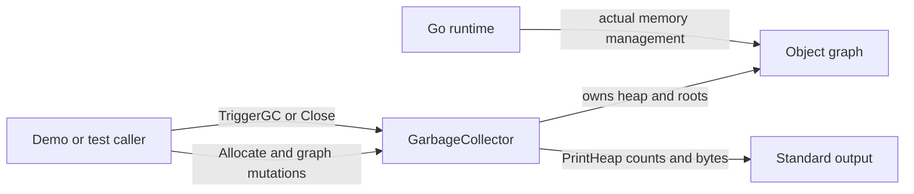
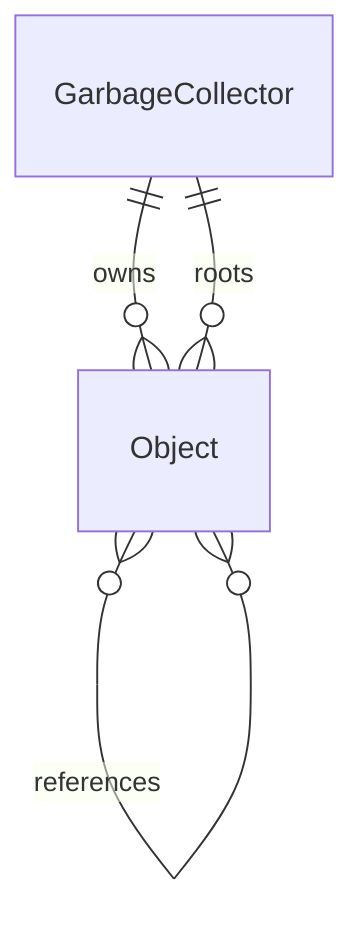
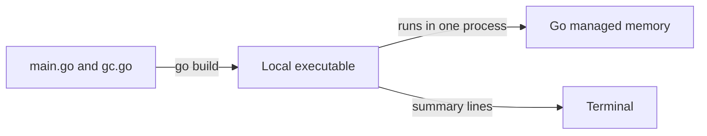

# Architecture

## Overview

The executable separates an example caller from one collector that owns all simulated heap state. Collection and mutation share an exclusive lock, while query methods use its read side ([gc.go:27](../../gc.go#L27), [gc.go:101](../../gc.go#L101), [gc.go:162](../../gc.go#L162)).

## Components

| Component | Responsibility | Lives in | Talks to |
| --- | --- | --- | --- |
| Demo | Constructs graph, changes roots, prints statistics. | [Root folder](../../), [main.go](../../main.go#L5) | Collector |
| Collector | Serializes operations, marks reachable objects, sweeps others, closes heap. | [Root folder](../../), [gc.go](../../gc.go#L27) | Objects and stdout |
| Object handles | Store payload, edges, owner and liveness. | [Root folder](../../), [gc.go](../../gc.go#L17) | Owning collector and referenced objects |
| Behavioral tests | Exercise graph and lifecycle contracts. | [Root folder](../../), [lifecycle_test.go](../../lifecycle_test.go#L8) | Collector and handles |

## Boundaries and contracts

- `Allocate` produces an **unrooted** handle; negative sizes and closed heaps return nil ([gc.go:39](../../gc.go#L39)). Root membership is explicit, unrelated to whether a Go variable still holds the pointer.
- `AddRoot` deduplicates roots. `AddReference` accepts duplicate edges. Both require live objects from this collector; invalid input is ignored. `RemoveReference` removes every matching edge ([gc.go:53](../../gc.go#L53), [gc.go:79](../../gc.go#L79)).
- Public operations synchronize individually. A caller must prevent another collection between allocation and rooting if the new object must survive ([README:17](../../README.md#L17)). The demo accesses private `rootSet` directly because everything is in `package main` ([main.go:35](../../main.go#L35)).
- `GetRefs` copies the edge slice, but returns the same object pointers, and `IsObjectMarked` means marked in the last cycle and still alive ([gc.go:172](../../gc.go#L172)).

## Data model

| Entity | Stored in | Key fields | Defined at |
| --- | --- | --- | --- |
| GarbageCollector | Go memory | heap, rootSet, lock, next ID, byte counters, cycle time/count, closed | [gc.go:27](../../gc.go#L27) |
| Object | Heap slice and retained handles | ID, byte payload, size, color, marked flag, refs, owner, alive | [gc.go:17](../../gc.go#L17) |

## State and persistence

Everything is process-local; there is no persistence path in [the implementation](../../gc.go#L17). `totalAlloc` is currently live **payload bytes**, `totalFreed` is cumulative released payload bytes, and sweep removes dead objects from the simulated heap. Cleanup clears payload and edges and sets `alive=false`; Go may still retain the object struct while a caller holds its pointer ([gc.go:132](../../gc.go#L132), [gc.go:146](../../gc.go#L146)).

## Deployment

The only build target is a local binary ([Makefile:13](../../Makefile#L13)); the inspected tree contains no service, container, CI or deployment configuration. There are no background workers ([README:19](../../README.md#L19)).

## Failure and scale

Invalid graph handles are silently ignored, while invalid allocation returns nil; ordinary Go allocation failure is not recovered ([gc.go:41](../../gc.go#L41), [gc.go:53](../../gc.go#L53)). Close is idempotent and makes future collection a no-op ([gc.go:105](../../gc.go#L105), [gc.go:147](../../gc.go#L147)).

Inferred from the loops, each cycle costs O(heap objects + reachable edges), with temporary traversal/live slices, and blocks API mutations and readers for its whole duration ([gc.go:102](../../gc.go#L102)). Root insertion scans existing roots and edge removal scans one object's edges ([gc.go:62](../../gc.go#L62), [gc.go:92](../../gc.go#L92)). This is one synchronized simulated heap, with no distributed or incremental collection design.
