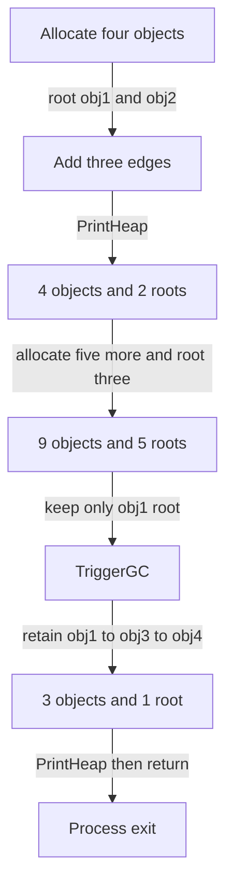
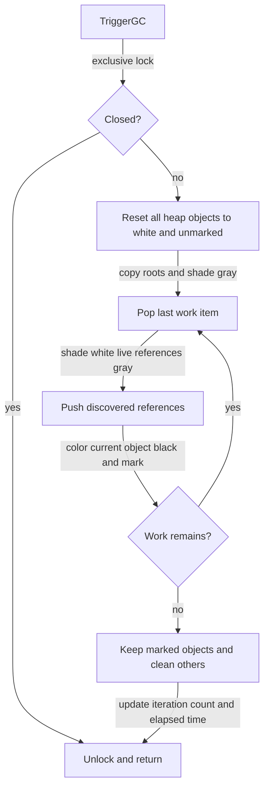
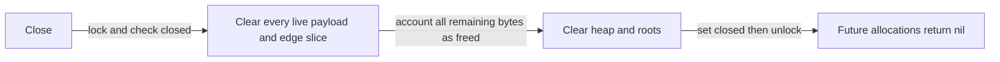
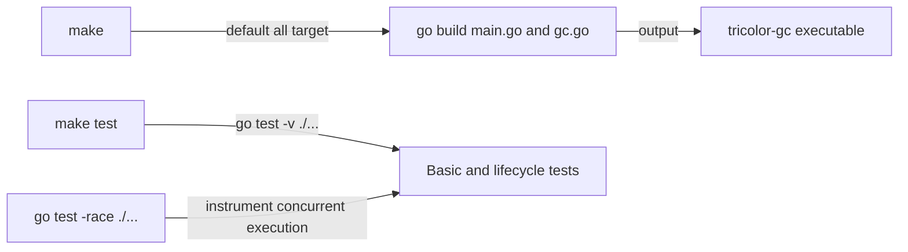

# Flow

## Startup

1. Go enters `main`; no arguments, configuration, service connections or workers are initialized ([main.go:5](../../main.go#L5) · [structure](03-structure.md#root)).
2. `NewGarbageCollector` returns an empty collector whose mutex and slices use Go zero values ([gc.go:37](../../gc.go#L37) · [structure](03-structure.md#root)).

## Demo lifecycle

1. Allocate payloads of 100, 200, 150 and 80 bytes, root the first two, then link obj1→obj3, obj2→obj4 and obj3→obj4 ([main.go:8](../../main.go#L8) · [structure](03-structure.md#root)).
2. `PrintHeap` therefore reports 4 objects, 2 roots, 530 live bytes and 0 freed bytes ([main.go:22](../../main.go#L22), [gc.go:188](../../gc.go#L188) · [structure](03-structure.md#root)).
3. Allocate five 100-byte objects, rooting iterations 0, 2 and 4. The sleep performs no collection: the second print has 9 objects, 5 roots, 1030 live bytes and 0 freed bytes ([main.go:25](../../main.go#L25) · [structure](03-structure.md#root)).
4. Directly truncate the root slice to obj1, then synchronously collect. Only obj1, obj3 and obj4 survive, producing 3 objects, 1 root, 330 live bytes and 700 freed bytes. The final sleep is also unnecessary, and `main` exits without calling `Close` ([main.go:35](../../main.go#L35), [gc.go:132](../../gc.go#L132) · [structure](03-structure.md#root)). These counts are derived from the source, not a fresh execution.

## Explicit collection

1. Hold the collector's exclusive lock for the whole cycle; return immediately if closed ([gc.go:101](../../gc.go#L101) · [structure](03-structure.md#root)).
2. Reset colors and mark flags, copy the roots into a work slice and shade them gray ([gc.go:108](../../gc.go#L108) · [structure](03-structure.md#root)).
3. Pop from the **end** of the variable named `queue`, making it a LIFO worklist. Skip already-black objects, enqueue white live references as gray, then blacken and mark the current object. Colors prevent a cycle from repeatedly discovering itself ([gc.go:117](../../gc.go#L117) · [structure](03-structure.md#root)).
4. Copy marked objects into a new live slice; for each unmarked object adjust payload accounting and clear payload/edges/liveness. Replace the heap and update cycle statistics before unlocking ([gc.go:132](../../gc.go#L132) · [structure](03-structure.md#root)). An empty root set therefore reclaims every heap object, including cycles ([lifecycle_test.go:20](../../lifecycle_test.go#L20) · [structure](03-structure.md#root)).

## Heap shutdown

1. Acquire the write lock and return without changes if already closed ([gc.go:147](../../gc.go#L147) · [structure](03-structure.md#root)).
2. Clean every object, transfer remaining live bytes to freed bytes, clear heap/roots and mark closed. Close does not increment collection counters ([gc.go:153](../../gc.go#L153) · [structure](03-structure.md#root)).

## Build and verification

1. `make` routes through `all` to build both implementation files into `tricolor-gc` ([Makefile:5](../../Makefile#L5), [Makefile:13](../../Makefile#L13) · [structure](03-structure.md#root)).
2. `make test` runs verbose tests without `-race`; the README supplies the separate race command. Basic tests cover allocation, roots, edges and reachability, while lifecycle tests exercise cycles, accounting, concurrent access, close and foreign/negative input ([Makefile:16](../../Makefile#L16), [README:21](../../README.md#L21), [gc_test.go:10](../../gc_test.go#L10), [lifecycle_test.go:8](../../lifecycle_test.go#L8) · [structure](03-structure.md#root)).
